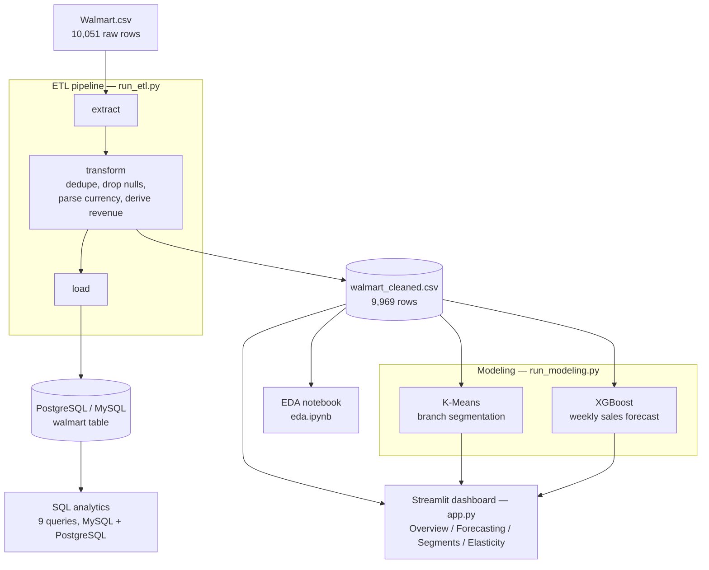
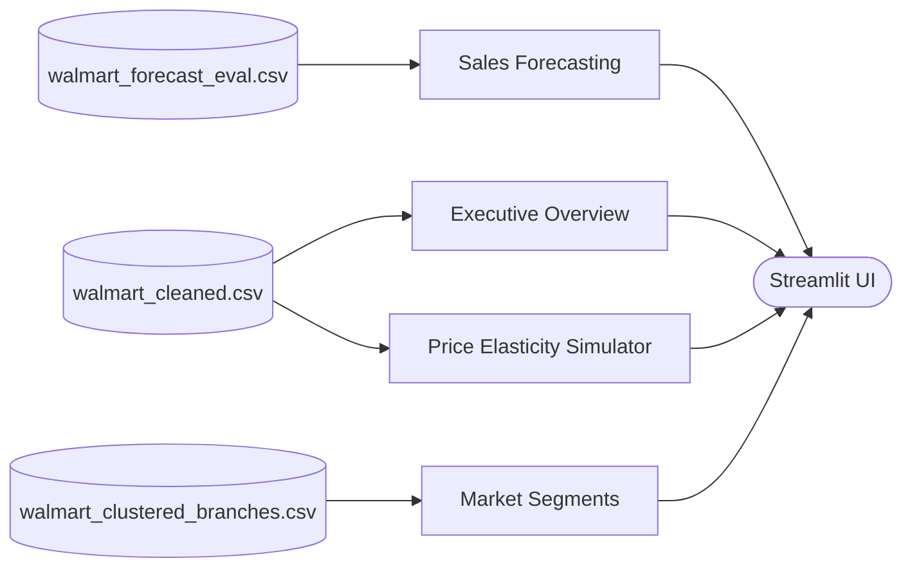

# Walmart Sales Intelligence Platform

An end-to-end analytics project built on ~10K Walmart sales transactions: a modular
Python ETL pipeline, a dual-dialect SQL analytics layer, two machine-learning models,
and a four-page Streamlit dashboard.

[](https://github.com/SaiNihar18/walmart-data-insights/actions)
[](https://www.python.org)
[](https://streamlit.io)
[](https://www.postgresql.org)

**Live dashboard:** https://walmart-data-insights.streamlit.app

---

## Overview

| | |
|---|---|
| **Dataset** | 10,051 raw transactions, 9,969 after cleaning |
| **Coverage** | 100 branches, 98 cities, 6 product categories, Jan 2019 – Dec 2023 |
| **Pipeline** | `run_etl.py` (extract / transform / load) then `run_modeling.py` (segmentation + forecasting) |
| **Storage** | CSV artifacts, plus PostgreSQL or MySQL via SQLAlchemy and Docker |
| **Interface** | Streamlit dashboard (`app.py`) with four interactive pages |
| **Quality** | pytest unit tests, GitHub Actions CI on every push |

---

## Architecture



The dashboard consumes the generated CSV artifacts directly, so it runs without a database:



---

## Repository layout

```
.
├── src/
│   ├── db.py                 SQLAlchemy engine factory (env-driven, PostgreSQL / MySQL)
│   ├── etl.py                extract / transform / load functions with logging
│   └── modeling.py           K-Means segmentation + XGBoost forecasting
├── tests/
│   └── test_etl.py           unit tests for the transform step
├── models/                   serialized artifacts written by run_modeling.py
├── app.py                    Streamlit dashboard (four pages)
├── run_etl.py                ETL entry point
├── run_modeling.py           modeling entry point
├── eda.ipynb                 exploratory data analysis
├── project.ipynb             original single-notebook walkthrough
├── MySQL Queries.sql         nine business queries, MySQL 8+ syntax
├── PostgreSQL Queries.sql    same queries, PostgreSQL 13+ syntax (matches run_etl.py)
├── docker-compose.yml        PostgreSQL + pgAdmin
├── .env.example              environment-variable template
└── requirements.txt
```

---

## Tech stack

| Area | Tools |
|---|---|
| Language | Python 3.10+, SQL |
| Data processing | pandas, NumPy |
| Database | SQLAlchemy 2, PostgreSQL, MySQL (`psycopg2`, `PyMySQL`) |
| Machine learning | scikit-learn (K-Means, `StandardScaler`), XGBoost |
| Visualization | Plotly, Matplotlib, Seaborn |
| Dashboard | Streamlit |
| Infrastructure | Docker Compose |
| Configuration | python-dotenv |
| Testing / CI | pytest, GitHub Actions |

---

## Data

### Dataset

| Property | Value |
|---|---|
| Source | Walmart 10K Sales Dataset (Kaggle, `@najir0123`) |
| Raw rows | 10,051 |
| After cleaning | 9,969 — removed 51 duplicates and 31 rows with null price/quantity |
| Branches / cities | 100 / 98 |
| Product categories | 6 |
| Date span | January 2019 – December 2023 |

### `walmart` table schema

| Column | Type | Notes |
|---|---|---|
| `invoice_id` | integer | unique transaction id |
| `Branch` | text | `WALM001`–`WALM100` |
| `City` | text | 98 distinct US cities |
| `category` | text | six product categories |
| `unit_price` | numeric | currency symbol stripped during ETL |
| `quantity` | numeric | units per transaction |
| `date` | text | `dd/mm/yy`; parsed with `STR_TO_DATE` / `TO_DATE` |
| `time` | text | `HH:MM:SS` |
| `payment_method` | text | Cash, Credit card, Ewallet |
| `rating` | numeric | 3.0 – 10.0 |
| `profit_margin` | numeric | 0.18 – 0.57 |
| `total` | numeric | derived: `unit_price × quantity` |

> **Coverage note.** *Food and beverages*, *Health and beauty*, and *Sports and travel*
> only contain transactions through Q1 2019. Weekly forecasting therefore covers the three
> categories with continuous 2019–2023 history: *Electronic accessories*, *Fashion
> accessories*, and *Home and lifestyle*.

---

## Getting started

### Prerequisites

- Python 3.10 or newer
- Docker and Docker Compose *(optional — only needed to load a live database)*

### Install

```bash
git clone https://github.com/SaiNihar18/walmart-data-insights.git
cd walmart-data-insights
python -m venv .venv && source .venv/bin/activate    # Windows: .venv\Scripts\activate
pip install -r requirements.txt
```

### Configure a database *(optional)*

```bash
cp .env.example .env        # edit credentials
docker compose up -d        # PostgreSQL on :5432, pgAdmin on :8080
```

### Run

| Step | Command | Produces |
|---|---|---|
| ETL | `python run_etl.py` | `walmart_cleaned.csv`; loads the `walmart` table if a database is configured |
| Modeling | `python run_modeling.py` | `models/*.joblib`, `walmart_clustered_branches.csv`, `walmart_forecast_eval.csv` |
| Dashboard | `streamlit run app.py` | http://localhost:8501 |
| Tests | `python -m pytest tests/` | — |

`run_etl.py` still writes the cleaned CSV if the database load fails, so the modeling
and dashboard steps work with no database at all.

---

## SQL analytics

Nine business questions, supplied for both engines: `MySQL Queries.sql` (MySQL 8+) and
`PostgreSQL Queries.sql` (PostgreSQL 13+, matching the schema `run_etl.py` creates). The
`date` column is stored as `dd/mm/yy` text and parsed explicitly wherever calendar logic
is required.

| # | Question | Techniques |
|---|---|---|
| 1 | Transactions and units sold per payment method | `GROUP BY`, aggregates |
| 2 | Highest-rated category in each branch | `RANK() OVER (PARTITION BY …)` |
| 3 | Busiest weekday per branch | date parsing, window function |
| 4 | Units sold per payment method | `GROUP BY` |
| 5 | Rating min / max / average per city and category | aggregates |
| 6 | Total profit per category | derived column, `ORDER BY` |
| 7 | Most common payment method per branch | CTE + `RANK()` |
| 8 | Transactions by day-part (morning / afternoon / evening) | `CASE`, hour extraction |
| 9 | Five branches with the largest year-over-year revenue decline (2022 → 2023) | CTEs, join, arithmetic |

---

## Machine learning

### Branch segmentation — K-Means

Per-branch features: total revenue, average transaction value, average profit margin,
average rating, and the normalized revenue share of each of the six categories. Features
are standardized with `StandardScaler`; `k = 4`.

| Cohort | Branches | Avg branch revenue | Avg rating | Avg margin | Character |
|---|---|---|---|---|---|
| A | 25 | ≈ $21,000 | 5.2 | 0.38 | High volume, thinner margins |
| B | 31 | ≈ $10,300 | 6.4 | 0.37 | Mid volume, balanced |
| C | 27 | ≈ $8,300 | 6.4 | 0.44 | Low volume, high margin |
| D | 17 | ≈ $8,200 | 6.4 | 0.42 | Smallest volume, high margin |

> Cluster indices are not stable between runs; the dashboard relabels cohorts by rank at
> display time.

### Weekly sales forecasting — XGBoost

| Aspect | Detail |
|---|---|
| Target | Weekly revenue per category |
| Features | 4 sales lags, 4-week rolling mean / std, month, ISO week, category one-hot |
| Split | Train Jan 2019 – Dec 2022, validate Jan – Dec 2023 |
| Validation RMSE | ≈ $748 |
| Validation MAPE | ≈ 74% |
| Scope | 3 categories with continuous history (see coverage note) |

MAPE is high because weekly per-category revenue is small and volatile (roughly
$1K–$4K per week). The model is a documented baseline rather than a tuned production
forecaster, and exact metrics shift with the installed XGBoost / scikit-learn versions.

---

## Dashboard

| Page | Contents | Data source |
|---|---|---|
| **Executive Overview** | Revenue, profit, rating and transaction KPIs; monthly trend; payment mix; revenue by category — with date, category and payment filters | `walmart_cleaned.csv` |
| **Sales Forecasting** | Actual vs. predicted weekly sales for a selected category, with RMSE and MAPE | `walmart_forecast_eval.csv` |
| **Market Segments** | Cohort profiles and a revenue-vs-rating scatter of all 100 branches | `walmart_clustered_branches.csv` |
| **Price Elasticity Simulator** | What-if price change (±20%) projected onto volume and revenue using per-category elasticity coefficients | `walmart_cleaned.csv` |

> The elasticity page uses published retail benchmark coefficients, not values estimated
> from this dataset.

---

## Testing and CI

`tests/test_etl.py` exercises the transform step: duplicate removal, null handling,
currency parsing, and the derived `total` column. GitHub Actions runs the suite on every
push and pull request to `main` (Python 3.10, pandas + pytest only).

---

## Deployment

**Streamlit Community Cloud** — point a new app at `app.py` on the `main` branch. The
committed CSV artifacts are sufficient to serve the dashboard.

**Render or a container platform** — install with `pip install -r requirements.txt`, then:

```bash
streamlit run app.py --server.port $PORT --server.address 0.0.0.0
```

---

## Selected findings

- **Revenue concentration.** *Fashion accessories* and *Home and lifestyle* account for
  about 81% of revenue and 91% of transactions; the other four categories are long-tail.
- **Payment mix.** *Credit card* leads on both transaction count (43%) and revenue, with
  *Ewallet* a close second.
- **Rating vs. volume.** The three low-volume categories average a 7.0 rating, against
  5.8 for the two high-volume ones.
- **Weekday demand is flat.** Daily transaction counts span only 1,322–1,468 across the
  week (an 11% spread) — no material day-of-week effect.
- **Branch structure.** One cohort of roughly 25 branches drives about double the average
  branch revenue; the remaining branches separate mainly on profit margin and rating
  rather than volume.

---

## Data source and credits

- Dataset: [Walmart 10K Sales Dataset](https://www.kaggle.com/najir0123/walmart-10k-sales-datasets)
  by [@najir0123](https://www.kaggle.com/najir0123) on Kaggle.
- Built as a data engineering and analytics portfolio project.
